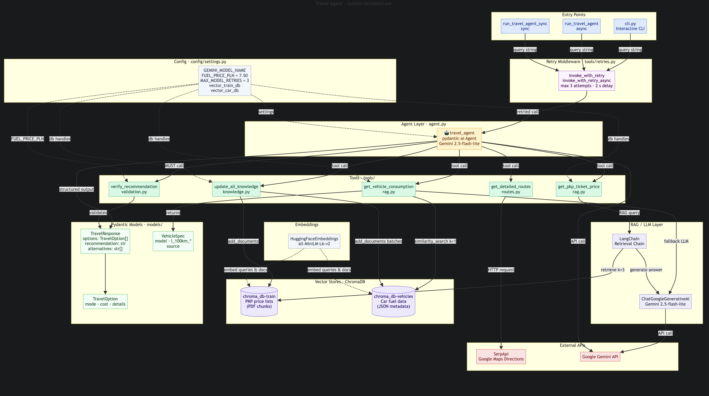
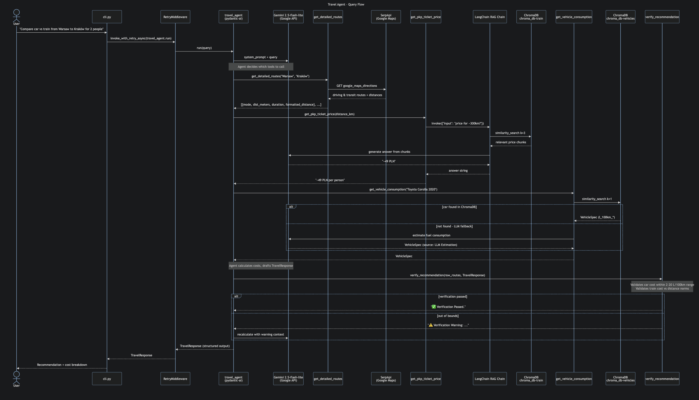

# Agentic Travel Coordinator

An AI agent that compares the cost and logistics of travelling by **Train vs. Car** in Poland. It uses RAG against two local ChromaDB vector stores (PKP train price lists and a car fuel-consumption database) and SerpApi for real-time distances and transit schedules.

````
🌍 AI TRAVEL COORDINATOR

👤 User: update
Added 3 new chunks to the train database. | Loaded 16753 cars to Chroma in 4 batches.

👤 User: I will travel from Cracov to Gdansk in Audi A3 2018 should I take train?
🤖 Analyzing routes and costs...

🏆 RECOMMENDATION: The train is a more cost-effective option for your trip.

--- PRICE BREAKDOWN ---
* Car        |   373.86 PLN | 597 km, 6 hr 5 min
* Train      |    101.00 PLN | 844 km, 9 hr 37 min````

## 🧭 System Overview

The system is an **AI Agentic Workflow** powered by Pydantic-AI. A Gemini 2.5-flash-lite agent acts as a reasoning engine, dynamically choosing which tools to call based on the user's query. All agent calls are wrapped in a retry middleware that handles transient model errors.



   ```bash
poetry run python evaluator.py
```
Starting Automated Evaluation...
------------------------------------------------------------
TEST #1: I want to travel from Lublin to Poznan
Both GOOGLE_API_KEY and GEMINI_API_KEY are set. Using GOOGLE_API_KEY.
  ✅ Train Cost: 79.0 PLN
  ❌ Car Cost Error: Got 232.54, expected ~200.20
  ✅ Recommendation: Balanced and logical.

---

## Core Components

| Layer | Component | Description |
|---|---|---|
| **Orchestrator** | `agent.py` · Pydantic-AI + Gemini 2.5-flash-lite | Manages tool calls and produces a typed `TravelResponse` |
| **Entry Points** | `cli.py` / `run_travel_agent` / `run_travel_agent_sync` | Interactive CLI, async and sync programmatic API |
| **Retry Middleware** | `tools/retries.py` | Up to 3 attempts with 2 s delay on transient model errors |
| **Navigation** | `tools/routes.py` · SerpApi | Real-time distance, duration, and transit schedules via Google Maps Directions |
| **Train RAG** | `tools/rag.py` · LangChain + ChromaDB | Retrieves PKP ticket prices from `chroma_db-train` (PDF chunks, k=3) |
| **Vehicle RAG** | `tools/rag.py` · ChromaDB | Looks up `l_100km_*` figures from `chroma_db-vehicles` (JSON metadata, k=1); falls back to Gemini if not found |
| **Validation** | `tools/validation.py` | `verify_recommendation` — the agent **must** call this before finalising output |
| **Knowledge Update** | `tools/knowledge.py` | `update_all_knowledge` ingests both PKP PDFs and the vehicle JSON into ChromaDB |
| **Embeddings** | HuggingFace `all-MiniLM-L6-v2` | Shared across both vector stores |
| **Config** | `config/settings.py` | `FUEL_PRICE_PLN = 7.50`, `GEMINI_MODEL_NAME`, DB paths, retry settings |
| **Models** | `models/travel.py` · Pydantic | `TravelResponse`, `TravelOption`, `VehicleSpec` |

---

## Operational Flow



```
User: "Is it cheaper for 4 people to go from Lublin to Warsaw?"

1. get_detailed_routes("Lublin", "Warsaw")  →  ~170 km, 2 h by car / 2 h 20 min by train
2. get_pkp_ticket_price(170)               →  RAG finds "170 km ≈ 50 PLN/person"
3. get_vehicle_consumption("Skoda Octavia") →  VehicleSpec: 5.8 L/100 km highway
4. Agent calculates:
     Train: 4 × 50 PLN            = 200 PLN
     Car:   (170/100) × 5.8 × 7.50 = ~74 PLN   (car fits all 4 passengers)
5. verify_recommendation(TravelResponse)   →  validates totals and winner
6. Output: TravelResponse with winner (Car) and alternatives
```

---

## How to Run

1. **Set up environment**
   ```bash
   poetry install
   ```

2. **Configure API keys** — create a `.env` file or export environment variables:
   ```
   GOOGLE_API_KEY=...
   SERPAPI_API_KEY=...
   ```

3. **Load knowledge bases** (only needed once, or when data changes):
   ```bash
   poetry run python cli.py
   # then type: update
   ```
   This ingests PKP train price PDFs from `./data/` and the vehicle database from `./data/master_vehicles_database.json` into their respective ChromaDB stores.

4. **Run the interactive CLI**:
   ```bash
   poetry run python cli.py
   ```
   Type your travel query and receive a cost breakdown with a recommendation. Type `exit` or `quit` to stop.

5. **Programmatic usage**:
   ```python
   from agent import run_travel_agent, run_travel_agent_sync

   # async
   result = await run_travel_agent("Train or car from Wroclaw to Warsaw for 2 people?")

   # sync
   result = run_travel_agent_sync("Train or car from Wroclaw to Warsaw for 2 people?")
   print(result.output.recommendation)
   ```